# License

- The license for the [IBM Z Open Editor](https://marketplace.visualstudio.com/items?itemName=IBM.zopeneditor), [IBM RSE API Plugin for Zowe CLI](https://www.npmjs.com/package/@ibm/rse-api-for-zowe-cli) that get attached to release items in this repository, as well as our [ZAPP nodejs library](https://www.npmjs.com/package/@ibm/zapp-core) can be found in the [product-licenses](./product-licenses/) folder in this repository. You can use this repository to file issues for the IBM Z Open Editor as well.
- The files managed in this repository contain files for presenting the <https://ibm.github.io/zopeneditor-about/> Web site, issues, discussion items, as well as the samples that can be found in these folders (except for the folder `product-licenses` and the attachments of our release items) that are used for tutorials. The license for these files you can find in the file [LICENSE](./LICENSE).

# IBM Z® Open Editor

**IBM Z Open Editor is an extension for Visual Studio Code that provides language support for the IBM® Enterprise COBOL, PL/I, HLASM, REXX, and (all new!) JCL languages.**

> Go here for the full [Documentation](https://ibm.github.io/zopeneditor-about/Docs/introduction.html?utm_source=vscode&utm_medium=referral&utm_campaign=vscode_marketplace) online.

Simplify your installation experience by using newly bundled extension packs that contain Z Open Editor as well as other extensions available for [IDzEE](https://marketplace.visualstudio.com/items?itemName=IBM.developer-for-zos-on-vscode-extension-pack) and [ADFz](https://marketplace.visualstudio.com/items?itemName=IBM.application-delivery-foundation-for-zos-vscode-extension-pack) customers.

This extension provides language support for the IBM Enterprise programming languages for z/OS®. It supports COBOL v6.5, PL/I v6.2, High Level Assembler for z/OS 3.1, TSO/E REXX, and z/OS MVS Job Control Language (JCL). This also includes capabilities for embedded statements in COBOL and PL/I for CICS 6.3, IMS 15.1.0 and SQL DB2 for z/OS 12.1. Earlier versions of any of these components will also work. IBM Z Open Editor realizes its language support by implementing fully functional [language servers](https://langserver.org/) together with additional editor enhancements that enable IBM Z developers to utilize features such as

- Real-time syntax checking and highlighting while you type
- Problems view with all syntax errors and (in COBOL) unreachable code
- Outline view and outline search
- For both variables and paragraphs:
  - Declaration hovers
  - Peek definition
  - Go to definition
  - Find all references
- Code and variable completion
- Finding and navigating references
- Previewing of included copybooks and include files as well as assembler macros
- Navigate to copybook and include file sources
- Refactoring such as "rename symbol"
- Custom code snippet support and more than 200 high value code snippets for COBOL, PL/I, and JCL out of the box
- Search and replace refactoring across multiple program files

To learn more about the IBM Z Open Editor extension's capabilities, we suggest that you walk through our [documentation](https://ibm.github.io/zopeneditor-about/Docs/introduction.html) and try it with the [example repository](https://github.com/IBM/zopeneditor-sample) provided on GitHub.

To interact with z/OS, this extension also automatically co-installs the [Zowe Explorer](https://marketplace.visualstudio.com/items?itemName=Zowe.vscode-extension-for-zowe) VS Code Extension. This extension can be used to edit COBOL, PL/I, HLASM, REXX, and JCL files opened on z/OS MVS™ and USS using the Zowe extension's Data Sets and USS views. It can even run JCL jobs via right-click and let's you download and browse job spool files.

IBM Z Open Editor v4 and beyond introduced advanced features that go beyond program editing! While the core Z Open Editor continues to provide full language support for COBOL, PL/I, REXX, JCL and HLASM for free, the advanced features add enterprise-level development capabilities that go beyond program editing.

You can purchase the required licenses through [IBM Developer for z/OS Enterprise Edition](https://www.ibm.com/products/developer-for-zos), [IBM Developer for z/OS Select](https://www.ibm.com/support/pages/ibm-developer-zos-select100), or [IBM Application Delivery Foundation for z/OS](https://www.ibm.com/products/app-delivery-foundation-for-zos).

All new users of Z Open Editor receive a 90-day evaluation trial for all the advanced capabilities. After the trial period, these capabilities require activation through either an RSE API server connection or imported activation kits, as described in [Activating advanced capabilities](./advanced_activation.md). Only the following features documented in this section require such a license.

For IBM Developer for z/OS Select customers the advanced features available are

1. [Remote Connection Emulator](./advanced_rce.md): Open a 3270 emulator hosted on the RSE API server by right-clicking a Zowe Explorer RSE API profile. The emulator opens in either a VS Code panel or an external browser, depending on your preference.
1. [z/OS Resources table](./advanced_resource_table.md): An all-new, feature-rich view that extends Zowe Explorer with a sortable table. Gain insights into your jobs, data sets, and UNIX files by listing, filtering, and sorting on many available properties.
1. [Data Elements view](./advanced_data_elements_view.md): Use this view to display information about the data elements in a COBOL or PL/I program, including those from copybooks and include files, in a table that can be sorted and filtered.
1. [Program Control Flow Browser](./advanced_control_flow.md): Use this view to display the control flow of a COBOL or PL/I program in an interactive graph.
1. Data flow graph browser for COBOL: Display the data flow of a data element in a COBOL program in an interactive graph. You can use this feature to examine how a data element is populated, modified, or written elsewhere.
1. [Preprocessor support for COBOL and PL/I](./advanced_preprocessor.md): Run a preprocessor either on a local workstation or remotely on z/OS, driven by a new ZAPP profile type. Continue to edit with full syntax checks except for the preprocessor statements, and automatically rerun the preprocessor each time you save. Compare the preprocessor generated code with the code side-by-side.
1. [HLASM macros support](./advanced_custom_macros.md): Use custom macro resolution in HLASM programs with references to macros in local files. The HLASM editor provides hovers, document links, go to definition, and code completion for macros. This feature supports one or more macro declarations per include file by pre-scanning macro files, provided they are found in local ZAPP property groups.
1. [Language Detection for data set members](./advanced_language_detection.md): Use Zowe Explorer with RSE API profiles to detect the programming language of a data set member opened in the editor.

IBM Developer for z/OS Enterprise Edition or IBM Application Delivery Foundation for z/OS customers can use in addition to the features above also

1. [IBM ZCodeScan](./advanced_zcodescan.md): Helps developers scan COBOL program files for best practice violations and security vulnerabilities, and it presents the results in a linter-like format.
1. [Dependency Based user build and advanced error reporting](./advanced_problems_view.md): Run a build of COBOL, PL/I, HLASM programs on a remote z/OS system through a right-click in Z Open Editor. Review informational, warning, or error messages issued by the compiler directly in the VS Code Problems view. Z Open Editor automatically downloads the build logs, parses them, and presents the messages in the Problems view with descriptions and error codes. Then navigate to warnings and errors in the code using a mouse, click in the Problems view to identify and resolve issues, and then rerun the build.
1. [Agent Mode](./advanced_agent_mode.md): Utilize Z Open Editor's MCP (Model Context Protocol) server in an Agent-based AI Chat panel in VS Code, providing it with context and data from your z/OS data sets, files, and jobs through Zowe APIs, as well as Z Open Editor configuration files for troubleshooting your setup.

## Table of contents

- [Privacy notice](#privacy-notice-for-feedback)
- [Prerequisites](#prerequisites)
- [Configuring Java](#configuring-java)
- [COBOL and PL/I Language Server Protocol capability examples](#language-server-protocol-capability-examples)
- [Advanced Capabilities](#advanced-capabilities)

## Privacy notice for feedback

The IBM Z Open Editor is provided free of charge, but we ask you to provide us feedback via the various means available such as submitting an [issue in our GitHub repository](https://github.com/IBM/zopeneditor-about/issues), providing review in the [VS Code Marketplace](https://marketplace.visualstudio.com/items?itemName=ibm.zopeneditor#review-details) as well as keeping the built-in telemetry and crash reports enabled.

This editor uses [Microsoft VS Code's Telemetry](https://code.visualstudio.com/docs/getstarted/telemetry) solution that collects telemetry data, which is used to help understand how to improve the product. While we appreciate the insights this data provides, we also know that not everyone wants to send usage data and you can disable telemetry as described in [Disable Telemetry Reporting](https://code.visualstudio.com/docs/getstarted/telemetry#_disable-telemetry-reporting). You can also read [IBM's General Privacy Statement](https://www.ibm.com/privacy/us/en/) to learn more about our policies.

This current release of IBM Z Open Editor will collect anonymous data for the following events:

- Activation of this VS Code extension
- Deactivation of this VS Code extension
- Opening, closing and saving files of a specific language such as COBOL, PL/I, HLASM, REXX, JCL
- Resolution of include files and assembler macros: number of successes or failures
- Using common language server operations such as code completion, references, definition, rename
- Using advanced features such as resource tables, data elements view, graph browsers, and MCP tools
- Starting a user build
- Responding to the feedback dialog
- Activating trial or full unlock licenses

Such events are logged with the following information:

- Event time
- Operating system and version
- Country or region
- Anonymous user and session ID
- The type of editor used (VS Code, Eclipse Theia, Red Hat Dev Spaces)
- Version numbers of Microsoft VS Code and IBM Z Open Editor
- The major Java version and vendor used by the language servers
- The name of the Z programming language used
- The name of the operation performed
- The type of z/OS protocol used (z/OSMF vs RSE API)

## Prerequisites

Review the [IBM Z Open Editor License Agreement](https://github.com/IBM/zopeneditor-about/raw/main/product-licenses/LICENSE.txt) and [Third Party Notices](https://github.com/IBM/zopeneditor-about/raw/main/product-licenses/NOTICES.txt) before downloading.

Here are the prerequisites for installing this extension in Visual Studio Code. Also check our [community forum](https://github.com/IBM/zopeneditor-about/discussions) for announcements for upcoming changes.

- Microsoft VS Code version 1.102.3 or later (recommended version: 1.105.1): We recommend using always the latest VS Code version available. If you do not have VS Code installed we recommend using the [Visual Studio Code for Java Installer](https://code.visualstudio.com/docs/languages/java#_install-visual-studio-code-for-java) provided by Microsoft as it automatically downloads and installs a Java SDK together with VS Code. (See, but skip the next bullet for the Java dependency, if you use this option.)

- Java SDK or JRE version 21 or later - 64 bit: The language servers included in this extension are implemented in Java. Therefore, you need to install and configure a 64-bit Java SDK or Runtime in order to start it successfully. We recommend installing VS Code for Java as described above, but if you already have VS Code or want to install Java yourself then you can choose from the following options:
  - You can use versions 21 of [IBM's Semeru Runtime](https://developer.ibm.com/languages/java/semeru-runtimes/) that can be [downloaded here](https://developer.ibm.com/languages/java/semeru-runtimes/downloads).
  - You can use [Oracle Java 21](https://www.oracle.com/java/technologies/downloads/#java21).
  - You can also use the [OpenJDK](https://adoptium.net/temurin/releases?version=21&os=any&arch=any).
  - Newer versions of Java should also work, but are not as rigorously tested for Z Open Editor as Java 21.
  - Various settings are provided to configure how the extension uses Java. See the [Configuring Java](#configuring-java) section below for more details.
- Zowe CLI 8.0.0 or newer (optional, but recommended) and the Zowe Explorer VS Code extension v3.0.0 or newer (required): To make use of [Zowe](https://zowe.org) to open and edit files directly from z/OS MVS or USS, you need Zowe client software and either IBM RSE API or z/OSMF configured. For more information, see [Installing Zowe CLI](https://docs.zowe.org/stable/user-guide/cli-installcli) and [VS Code Extension for Zowe](https://marketplace.visualstudio.com/items?itemName=Zowe.vscode-extension-for-zowe#user-content-prerequisites). Once installed, you must [create a Zowe CLI team configuration file](https://ibm.github.io/zopeneditor-about/Docs/interact_zos_overview.html) so that data sets can be found and accessed. The installation of Zowe CLI is entirely optional. Z Open Editor and Zowe Explorer can operate completely independently of it.

- (Optional) Git: To use the features that involve Git, you must install Git and have it available in your system path so that VS Code can display it. On Macs, Git comes out of the box. On Linux, you can install Git with your distribution's package manager. On Windows, you can get Git from <https://git-scm.com>.

If you are looking for some COBOL, PL/I, HLASM, REXX or JCL sample code that you can use to explore the editor features then you can use samples that we maintain on Github. Assuming that you have Git installed, create a work directory somewhere on your machine and clone the sample repository:

```bash
git clone https://github.com/IBM/zopeneditor-sample.git
```

Then once you finished installing the IBM Z® Open Editor extension open the directory `zopeneditor-sample` using the `File > Open...` menu.

## Configuring Java

The COBOL, PL/I, HLASM, and REXX language servers utilized by IBM Z Open Editor were implemented using the Java programming language. Therefore, a Java Runtime is required to be available via settings or the program path to start in VS Code. The IBM Z Open Editor extension utilizes VS Code user settings to configure which and how Java should be used. These settings allow you to select the specific installation of Java to pick, in case you have several installations, as well as set parameters such as how much memory you want the language servers to use.

### Selecting the Java installation to use

Before starting a language server the language server clients in the IBM Z Open Editor VS Code extension try looking in different places to find a matching Java installation. They will look in the following places in this specific order and pick the first Java installation they can find that is at least Version 21 and 64-Bit. If it finds a Java that fails the test against these criteria it will continue searching:

1. The `zopeneditor.JAVA_HOME` VS Code user setting.
1. The `java.home` VS Code user setting.
1. The `JAVA_HOME` environment variable.
1. The PATH defined for the environment in which Z Open Editor runs (i.e. you default Windows or MacOS path)
1. A typical platform-specific location. For example, on MacOS it will execute the `/usr/libexec/java_home -V` and on Windows the `where java.exe` commands to locate a valid Java installation.

As you can see user settings always take precedence over the other options listed, which enables you to specify a different Java version for IBM Z Open Editor than the default on your computer in case you have installed multiple version. If you used the recommended [Visual Studio Code for Java Installer](https://code.visualstudio.com/docs/languages/java#_install-visual-studio-code-for-java) the `java.home` user setting was set by this installer. Also note, that the methods at the end of the list require a significant amount of time as they are executing programs on your system. To improve startup times you should consider user settings as they provide the best startup performance.

If Java cannot be located check the VS Code Output view's Z Open Editor tab for any error and try to fix the problem by either setting the `JAVA_HOME` environment variable or create an entry in your VS Code user settings.

To define a user setting use the Preferences > Settings menu and either locate the setting in the graphical editor under IBM Z Open Editor or edit the setting json file directly by adding an entry as follows using an absolute path name to the Java installation directory.

On Mac:

```json
"zopeneditor.JAVA_HOME": "/Library/Java/JavaVirtualMachines/jdk21/Contents/Home"
```

On Windows:

```json
"zopeneditor.JAVA_HOME": "C:\\Program Files\\Java\\jdk21"
```

### Configuring the Java memory allocation

By default, the language server clients that start the language servers for COBOL, PL/I, HLASM, and REXX allocate a maximum of 512 MB of memory for each. In other words, they start using much less memory in the beginning, but you might run out of memory when working on large program files; or your computer might not support such a large amount of memory in the first place. To have more flexibility in how much memory the language servers are allowed to allocate, the following VS Code Setting is provided to specify the maximum value. When you use both COBOL and PL/I, you need to double the amount specified.

```json
"zopeneditor.server.memoryAllocation": 640
```

## Language Server Protocol capability examples

The following animations just give you glimpse of the capabilities available in IBM Z Open Editor. We are showing you different examples using different programming languages, but most of the features shown here are available for all four languages: COBOL, PL/I, HLASM, JCL, as well as REXX.

### Outline view explorer

You can use this view to:

- Expand and collapse sections such as Division Headings, Section Headings, and Variable Group Names in the Outline View.
- Recognize includes, procedures, loops quickly via the icons located by the various items.
- Go to a wanted location in the code by clicking that section header in the view.
- Sort by Position, Name, or Type.

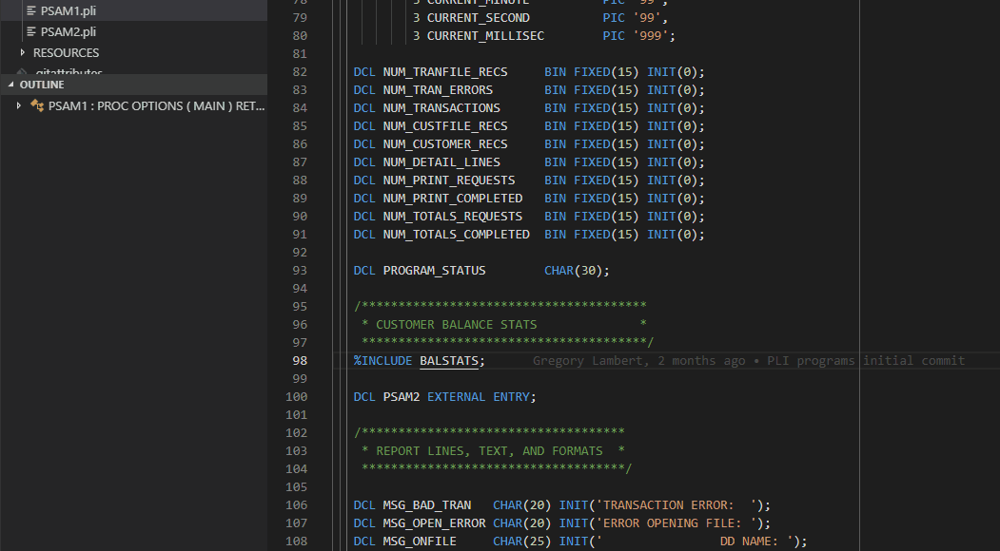

Here is an example showing an Outline View for an High Level Assembler program listing and providing rapid navigation to CSECT, DSECT, and MACRO instructions:

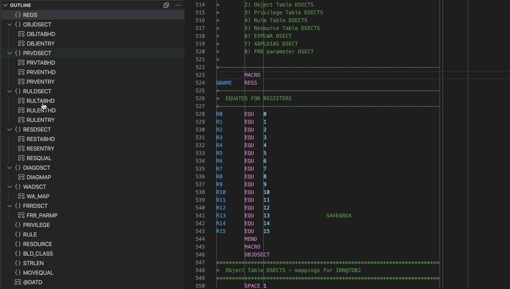

### Outline view search

Searching for identifiers within the outline by pressing `Ctrl+Shift+O` (PC) or `Cmd+Shift+O` (Mac) within the Editor window.

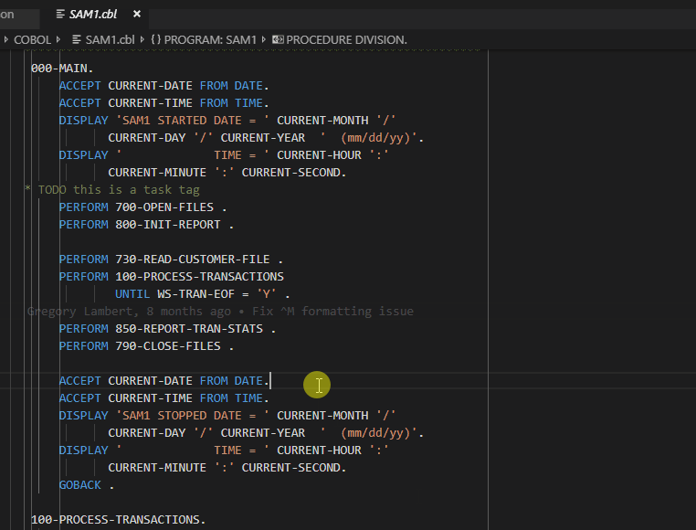

### Code and variable completion

When you start typing a command, a selection list of commands and code snippets are displayed automatically or by typing `Ctrl+Space` depending on your preferences settings.
This feature also works for variable names defined in the program.

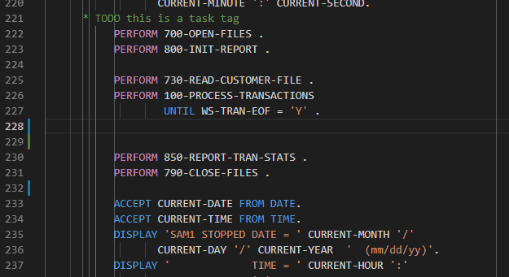

There is also code completion and documentation hovers for High Level Assembler commands and variables. Here is an example showing how new commands are added and how the hover can be used afterwards to check back on the syntax:

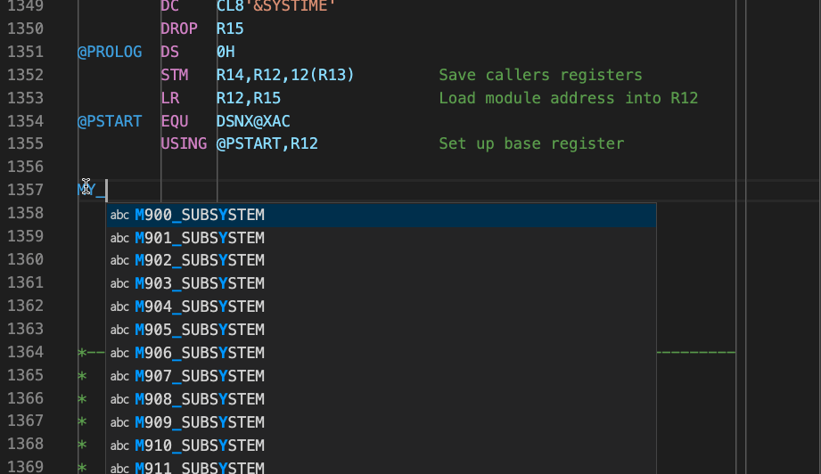

### Declaration hovers

To see the working storage definition or DCL definition and the parent group of a variable or a paragraph name, move your mouse cursor over to the variable or paragraph name.

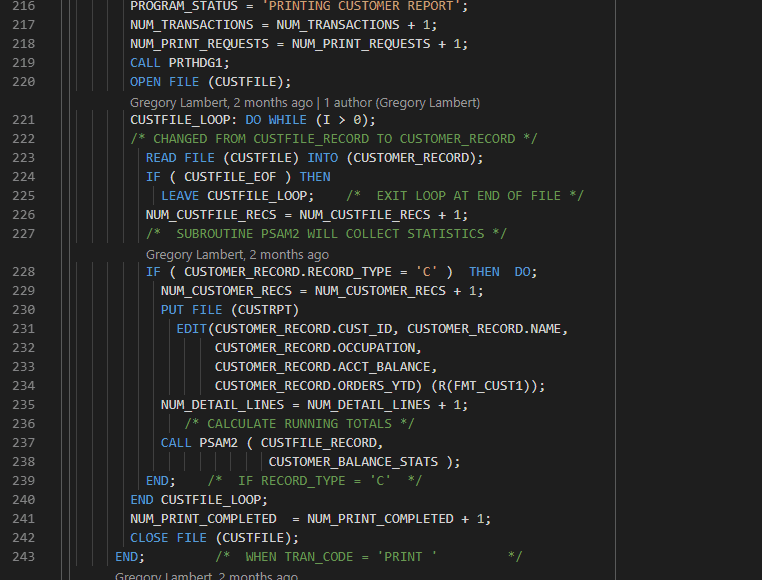

### Peek definition

Click on a variable or a paragraph name, right-click for menu, and choose `Peek Definition`. This opens a CodeLens box that shows where the variable or paragraph was defined in the code. If you use the keyboard shortcut `Alt+F12` (Windows) or `Option+F12` (Mac), the variable or paragraph name is only clicked once before the keyboard shortcuts are pressed. Double-click any result to go to that location in the file.

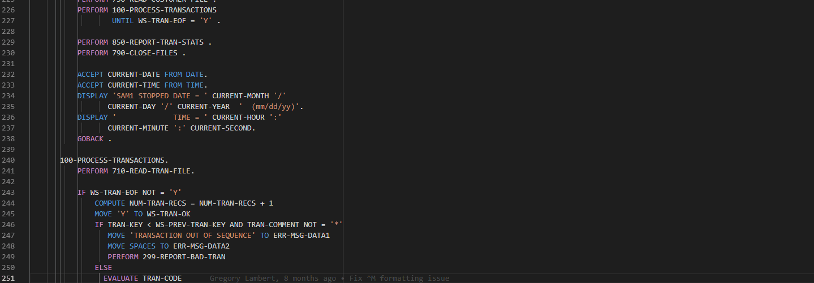

### Preview copybooks and include files

To preview the contents of a copybook or included file, move your mouse cursor over the copybook name in a `COPY` statement in COBOL or `%INCLUDE` in PL/I. To open the file in a separate editor, press `Ctrl+Click` (Windows) or `Cmd+Click` (Mac). If you have Zowe CLI installed, you can define a search path to resolve copybooks over the network against your remote MVS data sets or even USS directories (COBOL only at the moment).

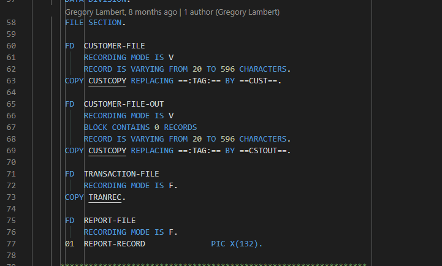

### Peek references

Select a variable or a paragraph name, right-click for menu, and choose `Peek References` or use shortcut `Shift+F12` (Windows and Mac). Double-click any result in the CodeLens box to go to that location in the file.

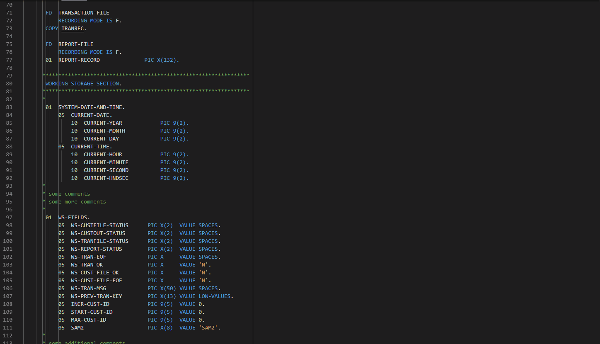

## User Build

The User Build feature helps COBOL, PL1, and HLASM developers to leverage IBM Dependency Based Build (DBB) toolkit right from their local VS Code or Eclipse Che development environment. A developer who is working on a COBOL, PL1, or HLASM applications can run a User Build to compile and link programs before the code is ready to be exposed to the repository for others to use. With User Build, you can compile your program without having to perform commits or pushes.

User Build automatically does the following when you click to run a build:

- Uploads only the the necessary files and folders to z/OS
- Resolves and uploads application's copybooks and include files
- Executes DBB user build script on z/OS
- Downloads log folders to your local directory so you don't have to navigate to the remote z/OS system to view them.

User Build allows developers to do their zOS development locally using modern tools without context switching.

To learn more see the [IBM Documentation](https://www.ibm.com/docs/en/developer-for-zos/16.0?topic=code-building-cobol-pli-hlasm-programs-user-build).

## Advanced Capabilities

Here are some example of the advanced capabilities.

### Preprocessor support for COBOL and PL/I

Run a preprocessor on your local workstation or your z/OS system driven by a new ZAPP profile type and then continue editing with full syntax checking (except for the preprocessor statements) and automatically rerunning the preprocessor at save. Compare the preprocessor generated code with your code side-by-side.

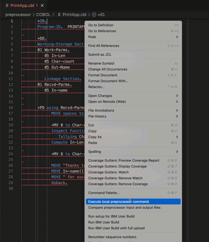

### z/OS Resources table

An all new feature rich Web view that extends Zowe Explorer with a sortable table. Gain insights into your jobs and data sets by listing, filtering, and sorting on many available properties.

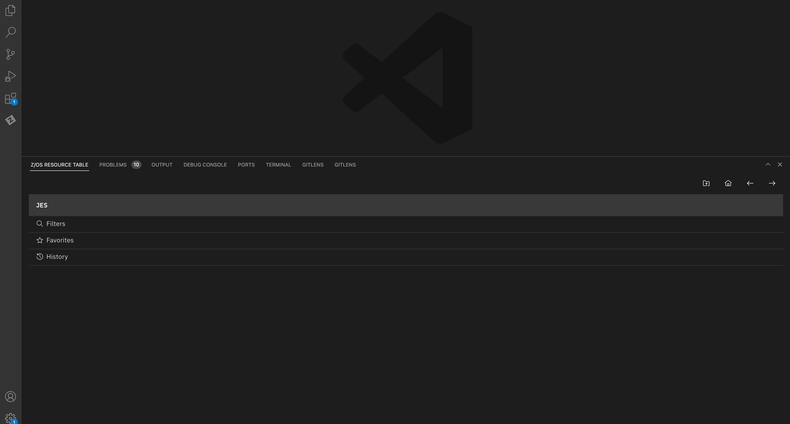

### Advanced Dependency-Based user build error reporting

User build logs are automatically downloaded, parsed, and presented in the editor's Problems view showing descriptions and error codes. Navigate to errors in your code with a mouse click in the Problems view to review and fix your issue and then rerun your build.

### Launching a 3270 emulator from Zowe Explorer

Remote Connection Emulator (RCE) integrates traditional 3270 tools and practices into Z Open Editor via Zowe Explorer. It provides access to the mainframe for viewing unique information and mainframe tools and processes that are not available in Zowe Explorer. By using Remote Connection Emulator, you can connect to the remote system and open a full-screen emulator. Z Open Editor's RCE client is based on the same technology as the RCE client built into the IBM Developer for z/OS Eclipse client.
